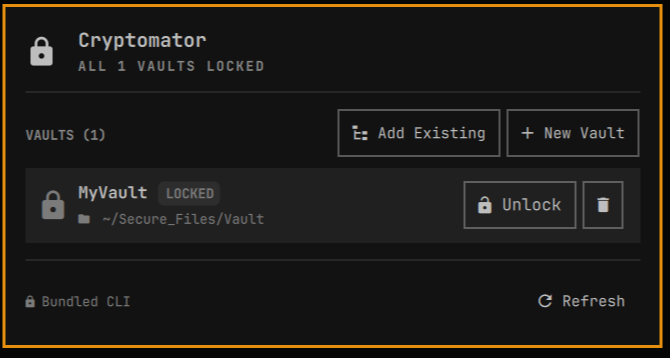
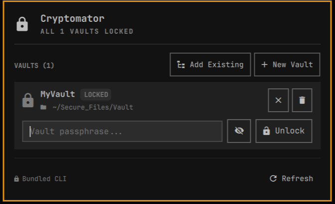
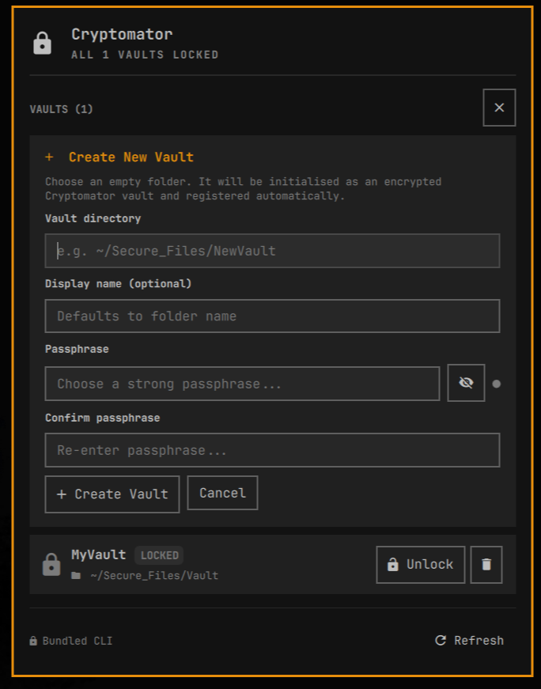
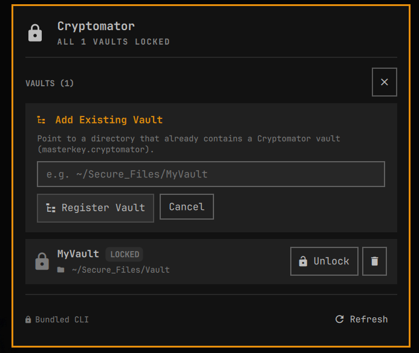

# Omarchy Cryptomator Plugin

<p align="center">
  
</p>

<p align="center">
  <strong>Native Omarchy status bar widget and control panel for <a href="https://cryptomator.org/">Cryptomator</a> vaults.</strong>
</p>

<p align="center">
  
  
  
  
</p>

---

## Overview

The **Omarchy Cryptomator Plugin** brings encrypted vault management directly to your Omarchy status bar. Easily lock, unlock, browse, and create Cryptomator vaults without opening desktop windows or interrupting your workflow.

Designed natively for **Omarchy Linux** and **Hyprland**, it automatically adapts to your current system theme, accent colors, and keyboard layer navigation.

---

## Visual Showcase

<div align="center">

| **Vaults Overview** | **Inline Passphrase Unlock** |
| :---: | :---: |
|  |  |
| *Status overview and registered vaults* | *Fast in-place unlock with passphrase reveal* |

| **Create New Vault** | **Add Existing Vault** |
| :---: | :---: |
|  |  |
| *Initialize fresh encrypted vaults* | *Import existing Cryptomator vaults* |

</div>

---

## Features

- 🔒 **Live Status Bar Widget**:
  - Optical glyph icon showing real-time lock status (`󰌾` locked, `󰌿` unlocked).
  - Highlights in your active theme's accent color when any vault is unlocked.
  - Hover tooltips with vault count summaries.

- ⚡ **Inline Unlock**:
  - Unlock and mount vaults directly from the bar panel.
  - Passphrase toggle to show or hide entered text.
  - Enter-to-submit and Esc-to-cancel shortcuts.

- 📂 **Full Vault Management**:
  - **Create Vault**: Initialize and register new encrypted vaults directly from the panel.
  - **Add Vault**: Easily register existing Cryptomator vaults.
  - **Open in File Manager**: One-click browsing of unlocked vaults in your default file manager.
  - **Lock Individual / All**: Lock specific vaults or use the one-click button to lock all vaults simultaneously.

- ⌨️ **Keyboard & Hyprland Friendly**:
  - Built-in keyboard shortcuts for quick control.
  - Layer-shell integration for smooth focus and dismissal.

---

## Installation

Install directly with a single Omarchy command:

```bash
omarchy plugin add https://github.com/pandaind/omarchy-cryptomator-plugin.git --enable
```

> [!TIP]
> This command automatically downloads, validates, and places the widget on your Omarchy status bar.

### Manual Installation (Optional)

If you prefer manual setup:

1. Clone the repository into your Omarchy user plugins directory:
   ```bash
   git clone https://github.com/pandaind/omarchy-cryptomator-plugin.git ~/.config/omarchy/plugins/omarchy-cryptomator-plugin
   ```

2. Add `"omarchy-cryptomator-plugin"` to your desired bar section in `~/.config/omarchy/shell.json`:
   ```json
   {
     "bar": {
       "layout": {
         "right": [
           { "id": "omarchy-cryptomator-plugin" },
           { "id": "omarchy.tray" },
           { "id": "omarchy.network" },
           { "id": "omarchy.audio" },
           { "id": "omarchy.power" }
         ]
       }
     }
   }
   ```

3. Reload the shell:
   ```bash
   omarchy-shell shell rescanPlugins
   # or
   omarchy-restart-shell
   ```

### Uninstallation

To remove the plugin:

```bash
omarchy plugin remove omarchy-cryptomator-plugin
```

For manual installations, remove the directory and reload the shell:

```bash
rm -rf ~/.config/omarchy/plugins/omarchy-cryptomator-plugin
omarchy-restart-shell
```

---

## Controls & Shortcuts

### Status Bar Mouse Actions

| Action | Result |
| :--- | :--- |
| **Left Click** | Toggle the Cryptomator panel open / closed |
| **Right Click** | **Lock All** — immediately locks all open vaults |
| **Middle Click** | Refresh status |

### Panel Keyboard Navigation

When the panel is open:

| Key | Action |
| :--- | :--- |
| `r` / `R` | Refresh vault statuses |
| `l` / `L` | Lock all unlocked vaults |
| `Esc` | Close form drawer / cancel prompt / close panel |
| `Enter` | Submit passphrase or confirm form |

---

## Hyprland Keybinding

To toggle the panel or lock all vaults via keyboard shortcuts, add bindings to your Hyprland configuration (e.g. `~/.config/hypr/bindings.lua` or `~/.config/hypr/hyprland.conf`):

```ini
# Toggle panel
bind = $mainMod, C, exec, omarchy-shell omarchy-cryptomator-plugin toggle

# Emergency lock all
bind = $mainMod SHIFT, C, exec, omarchy-shell omarchy-cryptomator-plugin lockAll
```

---

## IPC Commands

Control the widget from custom scripts or keybindings via `omarchy-shell`:

```bash
# Toggle panel visibility
omarchy-shell omarchy-cryptomator-plugin toggle

# Open or close the panel
omarchy-shell omarchy-cryptomator-plugin open
omarchy-shell omarchy-cryptomator-plugin close

# Lock all open vaults
omarchy-shell omarchy-cryptomator-plugin lockAll

# Refresh vault status
omarchy-shell omarchy-cryptomator-plugin refresh
```

---

## Requirements

- **Omarchy Linux** (with Hyprland & Quickshell)
- **`fuse3` / `fusermount3`** (pre-installed on Omarchy)
- **`python3`** (standard on Omarchy)

---

## License & Credits

- Licensed under the [MIT License](LICENSE).
- Developed by [pandac.in](https://pandac.in).
